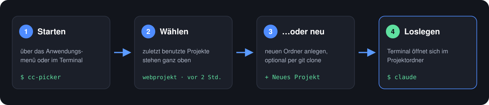
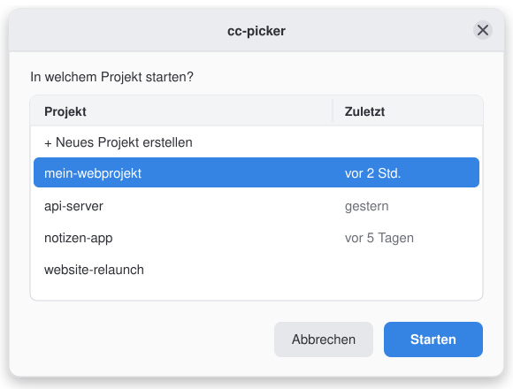

<p align="center">
  <a href="README.md">English</a> | <b>Deutsch</b>
</p>

<p align="center">
  
</p>

<p align="center">
  
  
  
</p>

**cc-picker** ist ein kleiner Projekt-Launcher für
[Claude Code](https://claude.com/product/claude-code): Du wählst einen
Projektordner aus einer Liste (oder legst einen neuen an), und Claude Code
startet **genau dort** – statt im Home-Verzeichnis oder vermischt mit
anderen KI-Coding-Tools.

> **Hinweis:** cc-picker ist ein unabhängiges Community-Projekt und **nicht mit
> Anthropic verbunden oder von Anthropic autorisiert**. "Claude" ist eine
> Marke von Anthropic, PBC. Dieses Tool startet lediglich die offizielle
> `claude`-Kommandozeile in einem von dir gewählten Ordner.

Schritt-für-Schritt-Erklärungen findest du im [Benutzerhandbuch](https://cc-picker.brue.nu/manual.html).

## So funktioniert's

<p align="center">
  
</p>

## Zwei Modi

<table>
  <tr>
    <th width="50%">🖱️ GUI-Modus</th>
    <th width="50%">⌨️ Shell-Modus</th>
  </tr>
  <tr>
    <td></td>
    <td></td>
  </tr>
  <tr>
    <td>Auswahlfenster per <code>zenity</code>, <code>kdialog</code> oder <code>yad</code> –
    je nachdem, was dein Desktop mitbringt. Claude Code startet in einem
    neuen Terminalfenster im gewählten Ordner.</td>
    <td>Nummeriertes Menü direkt im Terminal – ideal per SSH oder ohne
    Desktop. Start mit <code>cc-picker --shell-mode</code>; wird auch
    automatisch genutzt, wenn kein Dialog-Programm installiert ist.</td>
  </tr>
</table>

## Warum?

Wer mehrere KI-Coding-Tools parallel nutzt (z. B. Claude Code und ein
anderes Tool auf demselben Rechner), will in der Regel:

- 📂 **getrennte Arbeitskopien pro Tool** statt gemeinsam genutzter Ordner
- ⚡ **schnellen Projektwechsel**, ohne sich Pfade merken zu müssen
- 🏠 **Claude Code nicht versehentlich mit dem ganzen Home-Verzeichnis** als
  Arbeitsordner starten

cc-picker löst das mit einer einfachen Auswahlliste: Ordner wählen (oder neu
anlegen, optional mit `git clone`) → Claude Code startet direkt dort.

> **Keine Sandbox:** Der Startordner ist der Arbeitsordner von Claude Code,
> keine Sicherheitsgrenze. Je nach Berechtigungen kann Claude Code auch
> außerhalb davon lesen, ändern oder Befehle ausführen. Was es darf, regeln
> die Berechtigungseinstellungen von Claude Code selbst – cc-picker ändert
> daran nichts.

## Features

| | |
|---|---|
| 🪟 **GUI oder Shell** | standardmäßig das Fenster, Terminal-Menü per `--shell-mode`; GUI klappt mit `zenity` (GNOME & die meisten Desktops), `kdialog` (KDE) oder `yad` |
| 🕘 **Zuletzt benutzte oben** | zuletzt geöffnete Projekte stehen ganz oben, mit Zeitangabe; angeheftete Favoriten noch darüber |
| ↩️ **Weitermachen, wo du aufgehört hast** | neue Claude-Code-Sitzung starten, die letzte fortsetzen oder eine frühere auswählen |
| 🔎 **Suchen** | Teil eines Namens tippen, um die Liste zu filtern; im Terminal-Menü mit `fzf`, falls installiert |
| ⚡ **Direkt von der Kommandozeile** | `cc-picker mein-projekt` oder `cc-picker -` (letztes Projekt) – ganz ohne Liste |
| 🌿 **Git-Status auf einen Blick** | Branch und Zahl geänderter Dateien neben jedem Projekt |
| ➕ **Neues Projekt** | direkt aus der Auswahl anlegen: aus einer Vorlage (mit `git init` und vorbereiteter `CLAUDE.md`) oder per `git clone` – für GitHub genügt `benutzer/repo` |
| 🗂️ **Projekte verwalten** | im Dateimanager oder Editor öffnen, anheften, umbenennen, archivieren und wiederherstellen |
| 📁 **Mehrere Projektordner** | z. B. `~/claude-projects` und `~/code` in einer Liste |
| ⬆️ **Selbst-Update** | `cc-picker --update` installiert die neueste Version |
| 🔍 **Auto-Erkennung** | `claude`-Binary (PATH, dann gängige Installationsorte), Terminal-Emulator (gnome-terminal, konsole, xfce4-terminal, alacritty, kitty, xterm) und deine Login-Shell (bash, zsh, fish, …) |
| 🌐 **Deutsch & Englisch** | Sprache folgt automatisch der Systemsprache (`$LANG`) |
| ⚙️ **Keine hartcodierten Pfade** | alles per Konfigurationsdatei oder Umgebungsvariablen einstellbar |
| 🧩 **Desktop-Integration** | eigenes Icon im Anwendungsmenü |

## Linux-Distributionen

- **Arch Linux:** vom Maintainer auf dem eigenen System vollständig getestet.
- **Debian:** vom Maintainer im Einsatz bestätigt.
- **Ubuntu:** automatisierte Prüfungen und Funktionstests laufen auf GitHub Actions
  (`ubuntu-latest`), mit isolierten Testumgebungen ohne echte Claude-Sitzungen.
  Das ist kein vollständiger Desktop-End-to-End-Test.
- **Linux Mint, Manjaro, Fedora und openSUSE:** sollten mit den unten genannten
  Abhängigkeiten funktionieren, sind aber noch nicht durch eigene Distributionstests
  bestätigt. Der Installer erkennt `apt-get`, `pacman`, `dnf` und `zypper`.

Benötigt werden Bash ab Version 4, GNU/Linux-Werkzeuge und eine funktionierende
Claude-Code-Installation. Für das Auswahlfenster kommen `zenity`, `kdialog` oder
`yad` und ein unterstützter Terminal-Emulator hinzu. Der Terminal-Modus benötigt
keine bestimmte Desktop-Umgebung. Konkrete Distributionsversionen sind bisher
nicht in einer Testmatrix erfasst.

## Installation

```bash
git clone https://github.com/bruneler/cc-picker.git
cd cc-picker
./install.sh
```


Das Skript installiert:

| Datei | Zweck |
|---|---|
| `~/.local/bin/cc-picker` | ausführbares Skript |
| `~/.local/share/applications/cc-picker.desktop` | Eintrag im Anwendungsmenü |
| `~/.local/share/icons/cc-picker.svg` | App-Icon |
| `~/.config/cc-picker/templates/` | Projektvorlagen – nur einmal installiert, deine Änderungen bleiben erhalten |

**PATH wird automatisch eingerichtet:** Ist `~/.local/bin` noch nicht im
`PATH`, erkennt `install.sh` deine Login-Shell und ergänzt die passende
Zeile – nur einmal, auch bei mehrfacher Installation:

| Shell | Datei | Eintrag |
|---|---|---|
| bash | `~/.bashrc` | `export PATH="$HOME/.local/bin:$PATH"` |
| zsh | `~/.zshrc` | `export PATH="$HOME/.local/bin:$PATH"` |
| fish | `~/.config/fish/config.fish` | `fish_add_path "$HOME/.local/bin"` |
| andere | `~/.profile` | `export PATH="$HOME/.local/bin:$PATH"` |

Wer das lieber selbst macht: `CC_PICKER_NO_PATH=1 ./install.sh` – dann
wird die Zeile nur angezeigt, nicht eingetragen.

**Fehlt die Fensterunterstützung?** Beim Installieren erkennt cc-picker, ob ein
Dialogprogramm vorhanden ist. Fehlt es, bietet der Installer die Installation
an: unter KDE `kdialog`, sonst `zenity`. Er zeigt vorher den genauen Befehl
und führt ihn nur nach deiner Zustimmung aus. Lehnst du ab, bleibt das
Terminal-Menü verfügbar. Beim normalen Start wird nicht erneut nachgefragt.

Weitere Details unter [Abhängigkeiten](#abhängigkeiten).

## Nutzung

```bash
cc-picker                # Projektliste (Fenster)
cc-picker --shell-mode   # Terminal-Menü
cc-picker mein-projekt   # direkt im Projekt „mein-projekt“ starten (eindeutiger Anfang genügt)
cc-picker -              # im zuletzt benutzten Projekt starten
cc-picker -c mein-projekt  # … und dort die letzte Sitzung fortsetzen
cc-picker --update       # auf die neueste Version aktualisieren
cc-picker --help         # Hilfe, Projektordner und Konfigurationsdatei
cc-picker --version      # Version anzeigen
```

Oder im Anwendungsmenü nach **cc-picker** suchen.

1. Projekt wählen – angeheftete (★) und zuletzt benutzte stehen oben – oder
   **„+ Neues Projekt erstellen“** (siehe unten)
2. Wurde Claude Code in dem Projekt schon benutzt, wählst du:
   **Neue Sitzung**, **Letzte Sitzung fortsetzen** (`claude --continue`)
   oder **Frühere Sitzung auswählen** (`claude --resume`). Mit
   `CC_PICKER_SESSION` entfällt die Frage, ebenso mit `-n`, `-c` oder `-r`.
3. Ein Terminal öffnet sich im gewählten Ordner, `claude` startet dort.
   Beendest du Claude Code, bleibt die Shell im Projektordner offen.

**Suchen:** Im Terminal-Menü statt einer Nummer einen Teil des Namens
eintippen, um die Liste zu filtern (eine leere Zeile zeigt wieder alles).
Ist [`fzf`](https://github.com/junegunn/fzf) installiert, übernimmt es das
Menü (`CC_PICKER_FZF=0` schaltet das ab). Im Fenster erscheint ab 8
Projekten ein Eintrag **Suchen …**.

**Git-Status:** Bei Git-Repositories zeigt die Liste Branch und Zahl der
geänderten Dateien, z. B. `main · 3 geändert`. `CC_PICKER_GIT_STATUS=0`
schaltet das ab (für sehr große Repositories).

### Neue Projekte

Namen eingeben, dann entweder

- eine Git-URL zum Klonen – für GitHub genügt `benutzer/repo` – oder
- nichts, und eine **Vorlage** oder einen **leeren Ordner** wählen.

Vorlagen sind Ordner in `~/.config/cc-picker/templates/`. Ihr Inhalt wird ins
neue Projekt kopiert, `{{PROJECT_NAME}}` in Textdateien durch den
Projektnamen ersetzt und `git init` ausgeführt. `install.sh` legt eine
Vorlage `standard` mit `CLAUDE.md` und `.gitignore` an; ändere sie oder lege
eigene dazu. Ohne Vorlagen entfällt die Frage.

### Projekte verwalten

Über **⚙ Projekte verwalten …** in der Liste kannst du ein Projekt

- im Dateimanager oder Editor öffnen (`CC_PICKER_EDITOR`, sonst das erste
  installierte von `code`, `codium`, `zed`, `subl`)
- anheften, damit es immer oben steht (★)
- umbenennen
- archivieren: Der Ordner wird nach `.archive/` im Projektordner verschoben
  – nichts wird gelöscht – und lässt sich im selben Menü wiederherstellen

Claude Code merkt sich den Sitzungsverlauf pro Ordnerpfad. Nach dem
Umbenennen lassen sich die alten Sitzungen unter dem neuen Namen deshalb
nicht fortsetzen.

### Aktualisieren

`cc-picker --update` holt die neueste Version von GitHub und führt deren
`install.sh` aus, sofern sie neuer ist als die installierte. Einstellungen,
Vorlagen und Projektliste bleiben erhalten.

## Konfiguration

Standardmäßig liegen die Projekte in `~/claude-projects`. Um das oder
andere Einstellungen zu ändern, lege `~/.config/cc-picker/config` an:

```ini
# ~/.config/cc-picker/config
CC_PICKER_BASE=~/Projekte/ki
CC_PICKER_LANG=de
```

Die Konfigurationsdatei gilt auch beim Start über das Anwendungsmenü.
Gleichnamige Umgebungsvariablen haben Vorrang. Die Datei wird nur gelesen,
nie ausgeführt, und nur diese Schlüssel werden beachtet:

| Variable             | Standard                            | Bedeutung                                       |
|----------------------|-------------------------------------|-------------------------------------------------|
| `CC_PICKER_BASE`     | `~/claude-projects`                 | Projektordner; mehrere durch `:` getrennt (z. B. `~/claude-projects:~/code`) – neue Projekte landen im ersten |
| `CC_PICKER_BIN`      | automatisch erkannt                 | Pfad zur `claude`-Binary                        |
| `CC_PICKER_TERMINAL` | automatisch erkannt                 | zu verwendender Terminal-Emulator               |
| `CC_PICKER_SHELL`    | automatisch erkannt (`/etc/passwd`) | Shell, die nach Claude Code weiterläuft         |
| `CC_PICKER_LANG`     | aus `$LANG`                         | Sprache der Oberfläche: `de…` = Deutsch, sonst Englisch |
| `CC_PICKER_DIALOG`   | automatisch erkannt                 | Dialog-Programm: `zenity`, `kdialog` oder `yad` |
| `CC_PICKER_MODE`     | `gui`                               | was `cc-picker` öffnet: `gui` (Projektliste), `shell` (Terminal-Menü) oder `ask` (fragen) |
| `CC_PICKER_SESSION`  | `ask`                               | bei Projekten mit früheren Sitzungen: `ask` (fragen), `new`, `continue` oder `resume` |
| `CC_PICKER_GIT_STATUS` | `1`                               | `0` blendet Branch und Änderungen in der Liste aus |
| `CC_PICKER_EDITOR`   | automatisch erkannt                 | grafischer Editor für „Im Editor öffnen“, z. B. `code -n` |
| `CC_PICKER_FZF`      | `1`                                 | `0` nimmt das nummerierte Terminal-Menü, auch wenn `fzf` installiert ist |
| `CC_PICKER_UPDATE_REPO` | dieses Repository                | Git-Repository für `--update` (für Forks)       |

Einmaliges Beispiel per Umgebungsvariablen:

```bash
CC_PICKER_BASE=~/projekte CC_PICKER_BIN=/opt/claude/bin/claude cc-picker
```

## Abhängigkeiten

Ein Bash-Skript. Kein Framework, Laufzeitdienst oder Hintergrundprozess. Nutzt übliche Linux-Werkzeuge und deine vorhandene Claude-Code-Installation.

Dazu gehören GNU coreutils sowie `find`, `sort`, `sed`, `grep` und `awk`.

| Was | Wofür | Hinweis |
|---|---|---|
| `bash` | alles | auf praktisch jedem Linux vorinstalliert |
| [`claude`](https://claude.com/product/claude-code) | alles | die Claude-Code-Kommandozeile |
| ein Dialog-Programm | GUI-Modus & Start per Icon | eines von `zenity`, `kdialog`, `yad` – die meisten Desktops haben eines dabei |
| ein Terminal-Emulator | GUI-Modus | gnome-terminal, konsole, xfce4-terminal, alacritty, kitty oder xterm |
| `git` | optional | Klonen, `git init` bei Vorlagen, Git-Status in der Liste, `--update` |
| `fzf` | optional | durchsuchbares Terminal-Menü |
| `xdg-open` | optional | „Im Dateimanager öffnen“ (aus `xdg-utils`, meist vorinstalliert) |

**`install.sh` prüft die wichtigsten Abhängigkeiten.** Fehlt ein Dialog-Programm, bietet
es an, eines zu installieren (`kdialog` unter KDE, sonst `zenity`), und zeigt
vorher den genauen Befehl:

```text
zenity jetzt installieren? Ausgeführt wird:
  sudo pacman -S --needed zenity
Installieren? [J/n]
```

Ohne deine Bestätigung wird nichts installiert, und das Passwort fragt `sudo`
selbst ab – der Installer läuft nie als root. Automatische Nachinstallation überspringen:
`CC_PICKER_NO_DEPS=1 ./install.sh`. Ohne interaktives Terminal wird ebenfalls
nicht gefragt; der Installer zeigt stattdessen den Installationsbefehl. Erkennt
er keinen unterstützten Paketmanager, gibt er einen Hinweis zur manuellen Installation.

Dialog-Programm von Hand installieren:

| Distribution | Befehl |
|---|---|
| Arch / Manjaro | `sudo pacman -S zenity` |
| Debian / Ubuntu / Mint | `sudo apt install zenity` |
| Fedora | `sudo dnf install zenity` |
| openSUSE | `sudo zypper install zenity` |

Unter KDE statt `zenity` einfach `kdialog` nehmen.

> Ohne Dialog-Programm weicht cc-picker aufs Terminal-Menü aus – auch beim
> Start über das Anwendungsmenü, sofern ein Terminal-Emulator installiert ist.

## Deinstallation

```bash
rm ~/.local/bin/cc-picker \
   ~/.local/share/applications/cc-picker.desktop \
   ~/.local/share/icons/cc-picker.svg
```

Deine Projektordner bleiben dabei unberührt. Einen von `install.sh`
ergänzten PATH-Eintrag (markiert mit `# added by cc-picker install.sh`)
kannst du bei Bedarf aus deiner Shell-Config löschen.

Einstellungen, Vorlagen, die Liste der zuletzt benutzten und der
angehefteten Projekte liegen in kleinen lokalen Dateien. Der Starter sendet
diese Dateien weder an den Projektbetreiber noch an Matomo. Auch diese entfernen:

```bash
rm -r ~/.config/cc-picker ~/.local/state/cc-picker
```

## Datenschutz

Der **installierte cc-picker-Starter hat keine Telemetrie**. Einstellungen,
Projektverlauf und Vorlagen bleiben auf deinem Computer. Optionales Git-Klonen
verbindet sich mit dem gewählten Remote; `cc-picker --update` verbindet sich
mit GitHub (oder dem konfigurierten Update-Repository), und das Nachinstallieren
fehlender Pakete kontaktiert deine Paketquellen. Claude Code und geöffnete
Programme haben eigenes Netzwerkverhalten und eigene Datenschutzhinweise.

Die **Projektwebsite** [cc-picker.brue.nu](https://cc-picker.brue.nu/)
verwendet selbst betriebenes Matomo **nur nach deiner Zustimmung**, unabhängig
vom Starter. Die aktuelle Datenschutzerklärung nennt vollständige IP-Adressen,
Analyse-Cookies und keine technisch erzwungene automatische Löschfrist.
Du kannst die Auswertung in den
[Datenschutz-Einstellungen](https://cc-picker.brue.nu/#privacy-settings)
ablehnen oder deine Zustimmung widerrufen; DNT und GPC werden berücksichtigt.
Einzelheiten zu Daten, Speicherung, Hosting und Kontakt stehen in der
[Datenschutzerklärung](https://cc-picker.brue.nu/privacy.html).

## Mitwirken

Dies ist mein erstes öffentliches Open-Source-Projekt, und ich lerne dabei noch
dazu. Wenn dir Fehler auffallen oder du Verbesserungsvorschläge hast, freue ich
mich über einen freundlichen Hinweis oder ein Issue. Danke für deine Geduld
und fürs Mithelfen!

Sicherheitslücken bitte vertraulich über den in [SECURITY.md](SECURITY.md)
beschriebenen Meldeweg melden.

Issues und Pull Requests willkommen – siehe [CONTRIBUTING.md](CONTRIBUTING.md) (Englisch).

## Lizenz

[MIT](LICENSE)

---

Bei der Entwicklung von cc-picker haben ChatGPT und Claude Code unterstützt.
Ich betreue das Projekt und entscheide über Änderungen und Veröffentlichungen.
