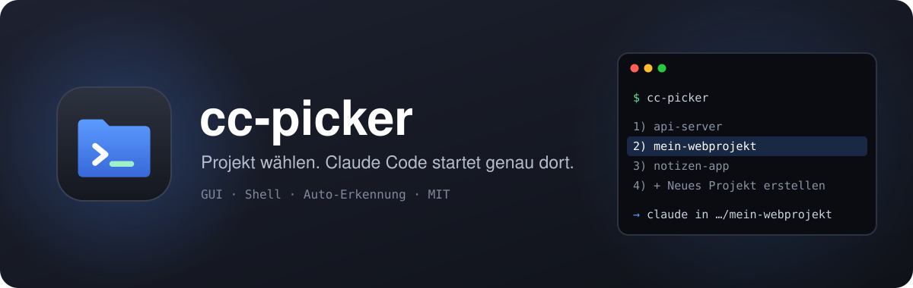
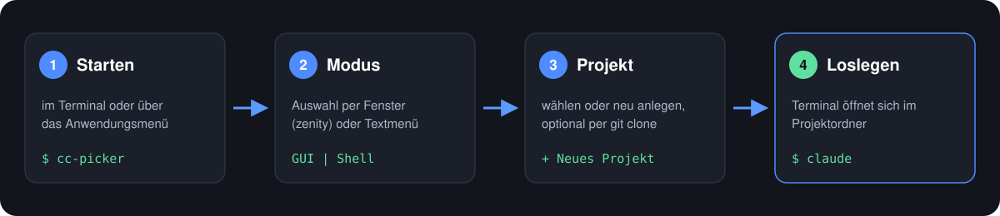
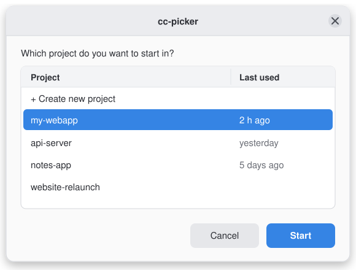
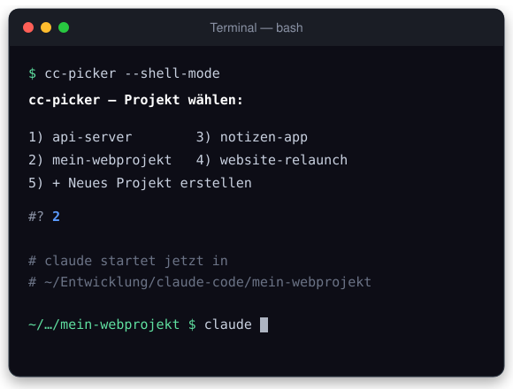
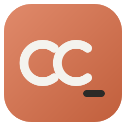

<p align="center">
  <b>English</b> | <a href="README.de.md">Deutsch</a>
</p>

<p align="center">
  
</p>

<p align="center">
  
  
  
</p>

**cc-picker** is a small project launcher for
[Claude Code](https://claude.com/product/claude-code): pick a project folder
from a list (or create a new one), and Claude Code starts **right there** –
instead of in your home directory or mixed up with other AI coding tools.

> **Note:** cc-picker is an independent community project and is **not
> affiliated with or endorsed by Anthropic**. "Claude" is a trademark of
> Anthropic, PBC. This tool simply launches the official `claude`
> command-line tool in a folder of your choice.

## How it works

<p align="center">
  
</p>

## Two modes

<table>
  <tr>
    <th width="50%">🖱️ GUI mode</th>
    <th width="50%">⌨️ Shell mode</th>
  </tr>
  <tr>
    <td></td>
    <td></td>
  </tr>
  <tr>
    <td>A picker window via <code>zenity</code>. Claude Code starts in a new
    terminal window inside the chosen folder.</td>
    <td>A numbered menu right in your terminal – great over SSH or without a
    desktop. Used automatically when <code>zenity</code> is missing.</td>
  </tr>
</table>

## Why?

If you use several AI coding tools side by side (e.g. Claude Code and
another tool on the same machine), you usually want:

- 📂 **separate working copies per tool** instead of shared folders
- ⚡ **quick switching between projects** without memorizing paths
- 🔒 **no accidental Claude Code sessions in your entire home directory**
  (needlessly broad file and execution access)

cc-picker solves this with a simple picker: choose a folder (or create one,
optionally via `git clone`) → Claude Code starts right there.

## Features

| | |
|---|---|
| 🪟 **GUI or shell** | choose at startup; falls back to the terminal menu when `zenity` is missing |
| ➕ **New project** | create one straight from the picker, optionally by cloning a Git remote |
| 🔍 **Auto-detection** | `claude` binary (PATH, then common install locations), terminal emulator (gnome-terminal, konsole, xfce4-terminal, alacritty, kitty, xterm) and your login shell (bash, zsh, fish, …) |
| 🌐 **English & German** | UI language follows your system locale (`$LANG`) |
| ⚙️ **No hard-coded paths** | everything configurable via environment variables |
| 🧩 **Desktop integration** | its own icon in your application menu |

## Installation

```bash
git clone https://github.com/bruneler/cc-picker.git
cd cc-picker
./install.sh
```



The installer sets up:

| File | Purpose |
|---|---|
| `~/.local/bin/cc-picker` | the executable script |
| `~/.local/share/applications/cc-picker.desktop` | application menu entry |
| `~/.local/share/icons/cc-picker.svg` | app icon |

**PATH is set up automatically:** if `~/.local/bin` isn't in your `PATH`
yet, `install.sh` detects your login shell and adds the matching line –
only once, even if you install repeatedly:

| Shell | File | Entry |
|---|---|---|
| bash | `~/.bashrc` | `export PATH="$HOME/.local/bin:$PATH"` |
| zsh | `~/.zshrc` | `export PATH="$HOME/.local/bin:$PATH"` |
| fish | `~/.config/fish/config.fish` | `fish_add_path "$HOME/.local/bin"` |
| other | `~/.profile` | `export PATH="$HOME/.local/bin:$PATH"` |

Prefer to do it yourself? Run `CC_PICKER_NO_PATH=1 ./install.sh` – the line
is then only printed, not written.

## Usage

```bash
cc-picker                # choose a mode (GUI or shell)
cc-picker --shell-mode   # go straight to the terminal menu
```

Or search for **cc-picker** in your application menu.

1. Choose a mode: **GUI** or **Shell**
2. Pick a project from the list – or **"+ Create new project"**
   (enter a name, optionally a Git remote URL to clone)
3. A terminal opens in the chosen folder and starts `claude`.
   When you quit Claude Code, the shell stays open in the project folder.

## Configuration

Everything via environment variables – no need to edit the script:

| Variable             | Default                        | Meaning                                          |
|----------------------|--------------------------------|--------------------------------------------------|
| `CC_PICKER_BASE`     | `~/Entwicklung/claude-code`    | folder where projects are listed and created     |
| `CC_PICKER_BIN`      | auto-detected                  | path to the `claude` binary                      |
| `CC_PICKER_TERMINAL` | auto-detected                  | terminal emulator to use                         |
| `CC_PICKER_SHELL`    | auto-detected (`/etc/passwd`)  | shell that keeps running after Claude Code exits |
| `CC_PICKER_LANG`     | from `$LANG`                   | UI language: `de…` = German, otherwise English   |

Example:

```bash
CC_PICKER_BASE=~/projects CC_PICKER_BIN=/opt/claude/bin/claude cc-picker
```

## Requirements

- `bash`
- [`claude`](https://claude.com/product/claude-code) (Claude Code CLI), installed and reachable
- optional: `zenity` for GUI mode
- optional: `git` for cloning when creating a new project

## Uninstall

```bash
rm ~/.local/bin/cc-picker \
   ~/.local/share/applications/cc-picker.desktop \
   ~/.local/share/icons/cc-picker.svg
```

Your project folders are left untouched. If `install.sh` added a PATH entry
(marked `# added by cc-picker install.sh`), you can remove it from your shell
config if you like.

## Contributing

Issues and pull requests are welcome – see [CONTRIBUTING.md](CONTRIBUTING.md).

## License

[MIT](LICENSE)
